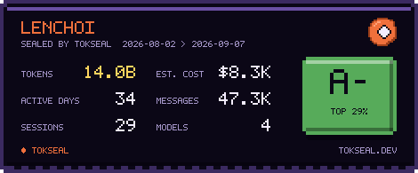

# tokseal

**Seal your AI coding usage into a badge.** tokseal reads your local AI coding
sessions, grades how hard you lean on AI, and turns it into a shareable card for
your GitHub profile — proof that you build with AI, at a glance.

> Local-first: your usage is parsed on your machine. Nothing is uploaded unless
> you explicitly opt in to the leaderboard.

<!-- Once the card endpoint is live, this becomes a live image: -->
<!--  -->



The card's text is drawn from a built-in 5×7 bitmap font, so it looks
pixel-perfect anywhere an SVG renders, including GitHub READMEs, which strip
external web fonts. Themes: `pixel` (default), `dark`, `light`.

```
  ◆ tokseal  2026-08-02 → 2026-09-07

  Grade      A-  (top 29%)
  Tokens     14.0B
  Est. cost  $8.3K
  Active     34 days   Sessions 28   Messages 47.2K

  By model
    claude-opus-5              $5.8K  31084 msgs
    claude-fable-5             $1.8K  12736 msgs
```

## Quick start

```bash
npx tokseal            # your usage summary and grade
npx tokseal card       # write an SVG card (tokseal.svg)
npx tokseal --json     # full report as JSON
npx tokseal login      # opt in: link this machine to your GitHub account
npx tokseal submit     # upload aggregate totals → tokseal.dev/u/<you>
```

After `submit`, drop the live card in your README:

```md

```

No install, no signup, no API key. tokseal reads `~/.claude/projects` (Claude
Code) directly. Support for more agents (Codex, Gemini, opencode, …) is on the
roadmap.

## The grade

The grade (S → C) blends four local signals so no single number can carry it:

| Signal | Why it counts |
| --- | --- |
| Total tokens | Raw scale of AI-assisted work |
| Active days | Consistency, not a one-off spike |
| Messages | Depth of interaction |
| Sessions | Breadth across projects |

Signals are smoothed with an exponential CDF (the curve
[github-readme-stats](https://github.com/anuraghazra/github-readme-stats) uses
for its rank), so there are no hard cliffs. The percentile is "top X%" — lower
is better.

## Privacy

- Parsing happens **entirely on your machine**, in a few hundred lines of
  dependency-light TypeScript.
- Individual messages and code are **never read for content** — only token
  counts, model ids, and timestamps.
- The leaderboard is strictly opt-in via `tokseal login` + `tokseal submit`.
  The payload is exactly what `@tokseal/core`'s `toSubmission` produces: totals,
  per-model totals, grade, and a date range. No message content, no file
  paths, no project names, no session ids. It is validated server-side by the
  same `validateSubmission` you can read in the repo.
- `tokseal login` uses a device-link flow: the CLI prints a short code, you
  approve it in the browser after GitHub sign-in, and the CLI stores a token in
  `~/.config/tokseal/config.json`. `tokseal logout` forgets it.

## Packages

| Package | What |
| --- | --- |
| [`@tokseal/core`](packages/core) | Local parser, pricing, aggregation, grading, and the SVG card renderer |
| [`tokseal`](packages/cli) | The CLI |
| [`@tokseal/web`](apps/web) | Pixel-art arcade site: hi-scores, `/u/<user>` profiles, `/api/card` endpoint, device-link login (Next.js + Supabase) |

## Roadmap

- [x] Claude Code parser + grade + SVG card + CLI
- [x] Hosted card endpoint (`/api/card?user=…`) + leaderboard + profiles (`apps/web`)
- [x] Opt-in `tokseal login` / `tokseal submit` with GitHub device-link flow
- [ ] Deploy: tokseal.dev on Vercel + Supabase, `npm publish`
- [ ] More agents: Codex, Gemini, opencode, Kiro
- [ ] Custom pricing overrides & themes

## Development

```bash
npm install
npm run build          # builds @tokseal/core then tokseal
node packages/cli/dist/index.js
npm run dev:web        # web app on :3000 (demo data until Supabase env is set)
```

Point the CLI at a local server with `--server http://localhost:3000` or
`TOKSEAL_SERVER=…`. Supabase setup: [`supabase/README.md`](supabase/README.md).

## License

MIT © Choi Minho ([@LenChoi](https://github.com/LenChoi))
